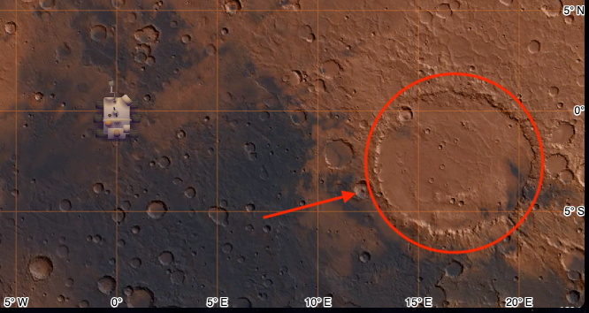

# Mars Rover Simulation

This is a [Next.js](https://nextjs.org/) project bootstrapped with [`create-next-app`](https://github.com/vercel/next.js/tree/canary/packages/create-next-app). It simulates a rover navigating over a map of Mars, allowing users to drive the rover using keyboard controls. The project incorporates basic obstacle detection to simulate a more realistic Mars rover experience.

DEMO: https://roveronmars.netlify.app/

## Project Features

- **Rover Animation:** The rover is represented as an animated icon on a digital map of Mars.
- **Control Mechanism:** The rover can be driven using the keyboard with the following keystrokes:
    - `F`: Move forward
    - `B`: Move backward
    - `R`: Rotate right
    - `L`: Rotate left
- **Obstacle Detection:** The simulation includes obstacles on the map, which the rover will detect and respond to, preventing it from passing through these obstacles.

### Rover Map Overview

Below is an image showing the mocked obstacles on the map where the rover navigates:



## Getting Started

To run the development server:

```bash
npm run dev
# or
yarn dev
# or
pnpm dev
# or
bun dev
```

Open http://localhost:3000 in your browser to see the result. You can start editing the page by modifying app/page.tsx. The page auto-updates as you edit the file.

## Known Limitations and Issues
 - **Movement Units:** The unit of movement is arbitrary and not defined in meters. Accurate geographical calculations over the Mercator projection used on the map would be required to calculate each movement, given the distortions at the poles.
 - **Zoom Level Constraints:** The map cannot display higher zoom levels; therefore, to adequately observe the rover and its movements, they are depicted out of scale.
Learn More
 - **Poor UX design**: There is no walkthrough or introduction to the commands to the user, no clear explanation of what is an obstacle  
